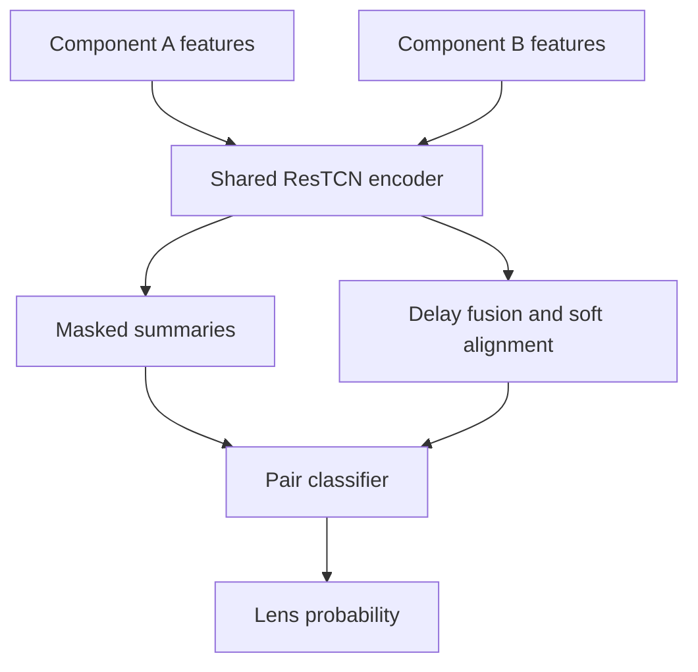

# ResTCN neural lens-pair classifier

## Purpose

The neural lens classifier scores whether two irregular component light curves
are compatible with delayed views of one latent quasar signal while tolerating
noise and microlensing-like low-frequency differences.

## Saved model

`models/resTCN.pt`

## Input representation

Each curve is converted to a masked sequence with nine channels:

1. time feature;
2. robust-normalised flux;
3. high-pass residual;
4. first local derivative;
5. second local derivative;
6. previous time gap;
7. next time gap;
8. local amplitude;
9. validity mask.

The default maximum sequence length is 80 measurements per component.

## Architecture



The two components use a shared residual temporal-convolution encoder. A delay
grid and differentiable alignment branch provide delay-aware evidence; pooled
representations feed the final binary classifier.

## Principal exported configuration

| Parameter | Default | Meaning |
|---|---:|---|
| `max_abs_delay` | 760 days | Maximum delay represented by the alignment grid |
| `max_len` | 80 | Maximum observations retained per curve |
| `hidden` | 72 | ResTCN hidden width |
| `tcn_blocks` | 8 | Residual temporal blocks |
| `kernel_size` | 5 | Temporal convolution kernel |
| `dropout` | 0.12 | Inference architecture dropout setting |
| `n_delay_grid` | 201 | Delay-grid resolution |
| `align_sigma_days` | 30 | Soft-alignment width |

Training-only values remain in the checkpoint configuration for compatibility.

## Usage

Use `notebooks/06_lens_neural_network.ipynb` or:

```bash
python Utility/LensNN.py data/cleaned_lightcurves.csv \
  --model models/resTCN.pt \
  --device auto \
  --output results/nn_pair_predictions.csv
```

`--device auto` selects CUDA, Apple MPS or CPU. Output columns are
`sourceID`, `compA`, `compB` and `Proba`.

## Limitations

The predicted probability is a candidate-ranking score. It is not a calibrated
Bayes factor, a lens confirmation or a substitute for the dedicated
time-delay methods.
