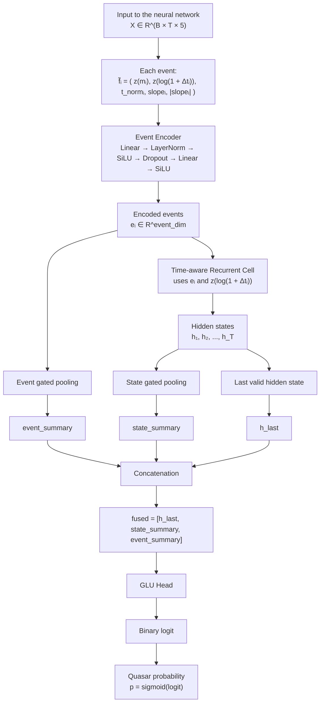

# Quasar Detection using Neural Network QSO-NET

We always work with light curves, the idea, is not to feed raw light curve to the model, with the data encoding we are aiming to improove the performances. we add to each mesurmnents more informations, like the local slope, abs of the local slope, and using log(dt with the next observation).

# The Data

We trained the NN two times to get 2 different models, one time we used true quasar and stars Data coming from gaia. The quasar object is the positive set, and the star is obviously the negative one.
We also used another set of data wich use synthetic quasars with true stars. The idea is that we might have issues with quasar detection if in our first training set is lacking quasar comportement diversity. We first used a [[DRW]](#1) model. But now we have better way if simulating Data wich is really close to true gaia data. The method is developped in the Data generating part.  
For our TrueData Dataset, we used 18.000 objects from gaia, 70% of them are Quasars and 30% of them are stars, we used 70% of the data as training sample, 15% as test sample and 15% as validation.

# Why a NN

The neural networks tend to generalise very well in practice. It also having a lot different archtecture, wich is very fun and cool to experiment with. The experiment process for this model was less scientific than for the RF, as CrossValidation demand very long and heavy computationnal ressources, and our model already are heavy computationnal models. The idea was to check the Bacc data at every experiment. The data used for the experiment and comparaison was the True Data, we only used the synthetic data set when the model was selected.

The first model that we tested was an already trained light curve classification model, we used FineTuning using [[LoRA]](#2) on a high performance transformer, the model is [[Astromer 2]](#3), We reach 92% Bacc on test Data. We trained the model with 5 epoch of LoRA finetuning, we didn't unfroze the whole model weights. with 4 000 000 parameterss, we aim to find a better models, as The RF have better performance while being lighter.

For now we aimed at one phlosophy, make a better model than the Big funetuned model with better performance clother with the RF performance, and with as few parameters as possible. We think that we will get a better generalising model, that will not over fit our training Data set with this mindset.

And so, our experimentation coninued with TCN models, as [[CNN]](#4) is already kind of widely used in astrphysic classification, But our data is more like a DRW, like said  Before. So the time series philospohie that we need to have is much more clother to a market variability classification than a classical astrophical problem. So we used a TCN, inspired by the [[QuantGAN]](#5) papper.
On those models we tried different architectures sometimes not using Skip connection, with more or less dropouts, The top performance achieve with this kind of model is 77%, while having a lightweight settings.

We also tryed some LSTM models but without achieving good results, our best BACC was only 70% there.

Now we present the best architecture that we got. It's a progressive RNN architecture, we named it QSO-NET. It's best Bacc was 96% wich is really good and over every other models that we previously got. While also haveing around 100 000 parameters wich is really light for performance that good. So here is the reciepe :
First the encoding Data is a transformed light curve we asume the notation for a light curve $f_i = (m_i,t_i,e_i)$ wich is respectively the flux, the time and the error of the mesurment; wich become :$
\tilde{f}_i =
\left(
z(m_i),
z\left(\log(1 + \Delta t_i)\right),
\frac{t_i - t_0}{t_N - t_0},
\frac{z(m_i) - z(m_{i-1})}{\max(\Delta t_i, \epsilon)},
\left|
\frac{z(m_i) - z(m_{i-1})}{\max(\Delta t_i, \epsilon)}
\right|
\right)
$ with $\Delta t_i = t_i - t_{i-1}$ with this transformation we aim to feed more rich information to our neural network, to help him get better performances. 

This model was cleanly trained, we used LR grid search, to find the best LR, then we used best LR with LR decay on plateau to improove the performance. We show the confusion matrix on the validation Data :

Matrice de confusion `(seuil = 0.47)`

| True label \ Predicted label | 0 | 1 |
|---|---:|---:|
| **0** | 🟦 **736** | 🟪 **38** |
| **1** | 🟪 **72** | 🟨 **1859** |

# Reference

<a id="1">[1]</a> 
Zu and .al, (2013).
IS QUASAR OPTICAL VARIABILITY A DAMPED RANDOM WALK?

<a id="2">[2]</a>
Edward J. Hu .al, (2021).
LoRA: Low-Rank Adaptation of Large Language Models

<a id="3">[3]</a>
Cristobal Donoso-Oliva .al, (2025).
Astromer 2

<a id="4">[4]</a>
Helen Qu .al (2022)
A Convolutional Neural Network Approach to Supernova Time-Series Classification

<a id="5">[5]</a>
Magnus Wiese .al (2019)
Quant GANs: Deep Generation of Financial Time Series

