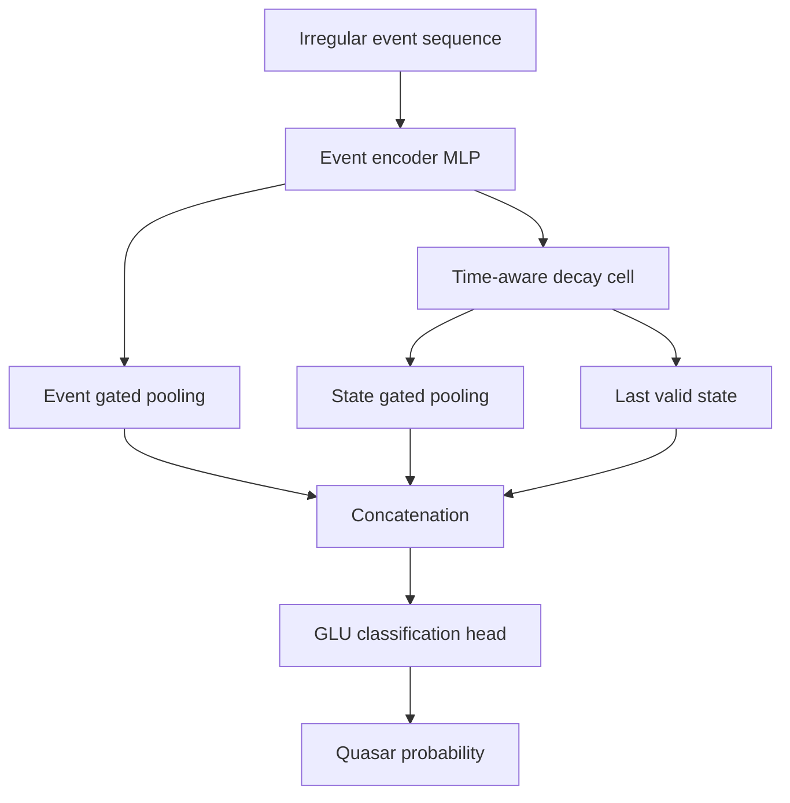

# EDSM-Lite quasar classifier

## Purpose

EDSM-Lite classifies each Gaia component as quasar-like or star-like directly
from an irregular light curve. It complements the Catch22 random forest with a
learned sequence representation.

## Saved models

| File | Training domain |
|---|---|
| `models/edsm_lite.pt` | Observed Gaia quasars and stars |
| `models/edsm_lite_synth.pt` | Synthetic quasars and observed Gaia stars |

## Event representation

For each observation the model receives five values:

\[
x_i = \left[
z(f_i),\
z\!\left(\log(1+\Delta t_i)\right),\
\tau_i,\
s_{\mathrm{robust}},\
m_i
\right],
\]

where \(z(f_i)\) is robust-normalised flux, \(\Delta t_i\) is the preceding
time gap, \(\tau_i\) is relative time, \(s_{\mathrm{robust}}\) is a sequence
statistic and \(m_i\) is the validity mask.

## Architecture



The exported inference implementation reconstructs model dimensions from the
checkpoint and loads weights in evaluation mode.

## Training summary

- approximate dataset size: 18,000 Gaia objects;
- group-aware train/validation/test split: 70% / 15% / 15%;
- focal binary loss with class weighting;
- learning-rate selection followed by decay;
- reported balanced accuracy: approximately 0.96–0.97;
- compact model size, substantially below the tested transformer baseline.

## Usage

Use `notebooks/04_quasar_inference.ipynb` or:

```bash
python Utility/Inference.py data/cleaned_lightcurves.csv \
  --domain real \
  --include-probabilities \
  --device auto \
  --output results/quasar_predictions.csv
```

`--device auto` selects CUDA, Apple MPS or CPU in that order.

## Interpretation and limitations

The probability is conditional on the training labels, Gaia cadence and
preprocessing. It is not an astrophysical confirmation. Inspect disagreement
between observed-data and synthetic-data models and validate out-of-domain
applications.
