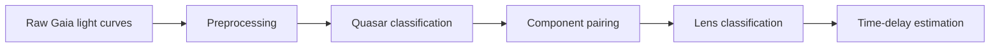

# TiLDe

**TiLDe** is a reproducible Python project for detecting quasar and
gravitational-lens candidates in Gaia light curves, then estimating
inter-component time delays.

The repository is organised for scientific handoff: research algorithms live
in importable `.py` modules, each module has a guided notebook.

## Pipeline



### Competitive Quasar Classification Using Light-Curve Variability

TiLDe provides two complementary quasar-versus-star classifiers that rely exclusively on light-curve variability. They do not use colours, spectra, astrometry, or source morphology:

* a Random Forest trained on Catch22 time-series features;
* EDSM-Lite, a lightweight neural network designed for irregularly sampled light curves.

On the held-out test set, the models achieve the following results:

| Model                   | Accuracy | Balanced accuracy | ROC-AUC |
| ----------------------- | -------: | ----------------: | ------: |
| Random Forest + Catch22 |   95.75% |            95.79% |  0.9928 |
| EDSM-Lite               |   93.61% |            92.45% |  0.9816 |

These results are competitive with published variability-based quasar classifiers. For example, Yang et al. (2021) report approximately 98.5% precision and 97.5% completeness using variability features extracted from SDSS Stripe 82 light curves. However, the results are not directly comparable: the surveys have different cadences, photometric uncertainties, selection functions, class distributions, and preprocessing procedures. Yang et al. also show that their approach remains effective when restricted to one or two years of observations, so the difference in temporal baseline alone cannot establish superiority.

Gaia light curves are particularly challenging because they are sparse, irregularly sampled, and frequently contain relatively few usable observations. In this context, the TiLDe results demonstrate that quasar variability remains highly discriminative even without colours or spectra.

On the external real-data application sample used in this project, both models recover or agree with approximately 94% of the available quasar reference labels. This value should be interpreted as an external recovery or agreement rate rather than a full accuracy estimate when exhaustive positive and negative ground-truth labels are unavailable. As a comparison, the Gaia GLEAN catalogue reports an expected purity above 95%, but a completeness of only approximately 47–51% when evaluated against external AGN catalogues.

These models remain open to improvement. The provided dataset generator can be used to construct controlled experiments, reproduce Gaia-like cadences and noise levels, and evaluate new architectures under known simulation parameters.

### Latent Cross-Correlation Classifier for Gravitationally Lensed Quasars

TiLDe also provides a neural network for classifying pairs of light curves as compatible or incompatible with gravitational lensing. The model uses a shared temporal encoder followed by a latent cross-correlation module evaluated over a grid of candidate delays. It jointly learns:

* a lens-compatibility score;
* a latent correlation map;
* an estimated time delay between the two components.

On the current held-out synthetic benchmark, the network achieves approximately 75% lens-classification accuracy. On the selected high-quality real-data evaluation subset, it reaches a reported precision of approximately 82%. This second result is conditional on the quality cuts, decision threshold, and construction of the evaluation sample; it should not be extrapolated to the complete Gaia candidate population.

The model should therefore be regarded as an exploratory and potentially novel application of learned latent cross-correlation, rather than as an established state-of-the-art lens classifier. Previous studies have already used temporal information to identify lensed quasars. Shu et al. (2021), for example, use autocorrelation features from unresolved light curves and obtain effective true-positive rates of 28–58% for doubles and 36–60% for quads while maintaining a false-positive rate below approximately 10%. Bag et al. (2022) report precision close to 100% and recall around 60% in simulations with ZTF-like noise. These methods address unresolved light curves and are therefore not directly equivalent to the resolved pair-classification problem considered by TiLDe.

The accompanying Random Forest lens classifier is retained as an interpretable classical baseline. It is currently less accurate and slower than the latent-correlation network on the project benchmarks. Consequently, the neural model is the recommended option for large-scale inference, while the Random Forest remains useful for feature analysis, diagnostic comparisons, and independent model validation.

The models and synthetic-pair generator are intentionally provided as extensible research components.

### References

1. Yang, D.-M., Xie, Z.-L., & Wang, J.-X. (2021). [*The feasibility and flexibility of selecting quasars by variability using ensemble machine learning algorithms*](https://doi.org/10.1088/1674-4527/21/4/99). Research in Astronomy and Astrophysics, 21, 99.

2. Carnerero, M. I., et al. (2023). [*Gaia Data Release 3: The first Gaia catalogue of variable AGN*](https://doi.org/10.1051/0004-6361/202244035). Astronomy & Astrophysics, 674, A24.

3. Shu, Y., Belokurov, V., & Evans, N. W. (2021). [*Discovering strongly lensed QSOs from unresolved light curves*](https://doi.org/10.1093/mnras/stab241). Monthly Notices of the Royal Astronomical Society, 502, 2912–2921.

4. Bag, S., Shafieloo, A., Liao, K., & Treu, T. (2022). [*Identifying lensed quasars and measuring their time delays from unresolved light curves*](https://doi.org/10.3847/1538-4357/ac51cb). The Astrophysical Journal, 927, 191.


| Stage | Python module | Guided notebook |
|---|---|---|
| Component grouping | `Utility/IdSep.py` | `notebooks/01_component_grouping.ipynb` |
| Cleaning and filtering | `Utility/Pretraitement.py` | `notebooks/02_preprocessing.ipynb` |
| Light-curve visualisation | `Utility/Plot.py` | `notebooks/03_visualisation.ipynb` |
| Quasar inference (RF + EDSM) | `Utility/Inference.py` | `notebooks/04_quasar_inference.ipynb` |
| Lens-pair random forest | `Utility/RF.py` | `notebooks/05_lens_random_forest.ipynb` |
| Lens-pair neural network | `Utility/LensNN.py` | `notebooks/06_lens_neural_network.ipynb` |
| Linear-interpolation delay | `Utility/time_delay_interpolation.py` | `notebooks/07_time_delay_interpolation.ipynb` |
| Adaptive P-spline delay | `Utility/time_delay_pspline.py` | `notebooks/08_time_delay_pspline.ipynb` |
| Package/import check | `Utility/__init__.py` | `notebooks/00_start_here.ipynb` |
| Synthetic smoke tests | `tests/smoke_test.py` | `notebooks/00_start_here.ipynb` |

## Start here

1. Follow [Windows and macOS installation](docs/INSTALLATION.md).
2. Read the [data contract](docs/DATA_FORMAT.md).
3. Open `notebooks/00_start_here.ipynb`.
4. Copy your CSV files into `data/` without changing the supplied model files.
5. Run the guided notebooks in numerical order.

The `data/` directory is intentionally empty because the research Gaia tables
are not redistributed in this archive. Each notebook checks its expected input
path before running and explains which file must be supplied.

## Time-delay command line

Classical interpolation:

```bash
python -m Utility.time_delay_interpolation data/cleaned_lightcurves.csv \
  --source-id 3361094865862486656 \
  --component-a 3361094865862486721 \
  --component-b 3361094865862486723 \
  --profile standard \
  --mc-samples 300
```

Adaptive P-spline:

```bash
python -m Utility.time_delay_pspline data/cleaned_lightcurves.csv \
  --source-id 5915407711751697280 \
  --components 5915407711751697345 5915407711751697347 \
  --names "A reference" B \
  --profile standard \
  --mc-samples 300
```

Batch P-spline run:

```bash
python -m Utility.time_delay_pspline data/cleaned_lightcurves.csv \
  --pairs configs/time_delay_system_pairs.csv \
  --profile legacy_notebook \
  --mc-samples 300 \
  --output-dir results/batch_time_delays
```

Run `python -m Utility.time_delay_interpolation --help` or
`python -m Utility.time_delay_pspline --help` for every option.

## Reproducibility

- `configs/time_delay_profiles.json` preserves quick, standard, original
  notebook and high-precision parameter adaptations.
- Gaia identifiers are loaded and exported as strings to prevent precision
  loss in spreadsheet software.
- Monte Carlo uncertainty draws use explicit random seeds.
- Batch results are checkpointed after every system.
- Existing trained models are kept in `models/`; their purpose and inputs are
  documented in `Models-Documentation/`.

## Documentation

- [Installation](docs/INSTALLATION.md)
- [Data format](docs/DATA_FORMAT.md)
- [Complete workflows](docs/WORKFLOWS.md)
- [Time-delay methodology](docs/TIME_DELAY_METHODS.md)
- [Supervisor handoff and troubleshooting](docs/SUPERVISOR_HANDOFF.md)
- [Change log](CHANGELOG.md)

## Scope

The preprocessing choices and trained models are adapted to Gaia epoch
photometry. Applying them to another survey requires validation, recalibration
and potentially retraining. Candidate probabilities and time delays are
scientific decision-support outputs, not automatic confirmations of a lens.

## Improovements

The time-delay component was developed under significant time constraints and leaves considerable room for improvement. First, the methodology should be validated more thoroughly using synthetic light curves with known time delays. The time-dependent regularization of the penalized spline could also be improved: the current rolling-MAD approach is relatively simple, whereas more advanced methods for locally adaptive smoothing exist in the literature.

The Monte Carlo procedure currently assumes Gaussian photometric errors when perturbing the observed fluxes. This assumption may not accurately represent real measurement errors. More importantly, even when the observational errors are Gaussian, the resulting distribution of estimated time delays does not have to be Gaussian. Because the inference problem is ill-posed, several competing solutions may exist, producing a multimodal distribution.

In such cases, uncertainty should be estimated separately around each mode. Global statistics such as the mean or median and the 16th to 84th percentile interval can be misleading, particularly when they fall between distinct modes. However, reliably determining which peaks represent genuine modes, assigning individual estimates to those modes, and identifying the physically correct solution are difficult problems. A robust solution may involve stochastic sampling, density estimation, clustering, or Bayesian model comparison. Developing and validating such an approach is left for future work.