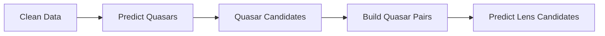
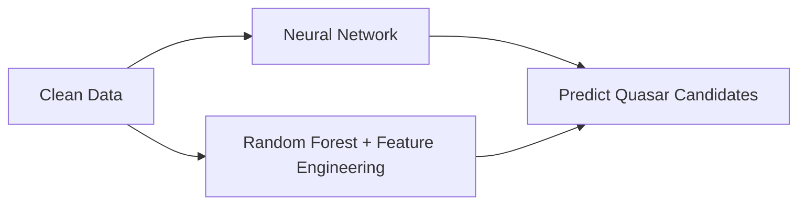
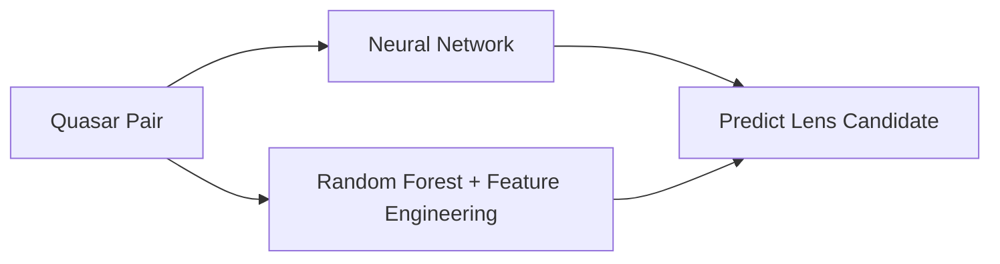

# TiLDe

**TiLDe** is a project designed to detect gravitational lensing candidates using light curves.

The tools in this repository are specifically adapted to **Gaia time-series data**. Results may not generalize well to other types of light-curve datasets without additional tuning or validation.

## Features

- Data-cleaning scripts
- Quasar candidate detection models
- Lens candidate detection models
- Explanatory resources and documentation

## Data-Cleaning Step

Data cleaning is a crucial part of the pipeline because all classifications are based on time-series measurements.

The goal is to determine, as accurately as possible, whether each measurement is relevant. This is done by using prior knowledge about the Gaia data and by exploiting information contained in nearby or related measurements.

## Workflow

The first step is to identify quasar-like light curves. Once quasar candidates are selected, close quasar pairs can be tested to detect correlated light variations.

The lens-detection step is designed to be invariant, as much as possible, to:

- Time delays
- Microlensing effects
- Noise

## Quasar Prediction

The goal of this step is to remove as many stars as possible from the dataset.

Two models are trained:

1. A neural network model
2. A random forest model with feature engineering

The combination of both models may produce more false positives, but it significantly reduces false negatives, which is preferred at this stage of the pipeline.

## Lens Prediction

After quasar candidates are selected, they are paired and passed through lens-detection models.

As in the quasar-prediction step, the pipeline combines a neural network approach with a random forest model using engineered features.

