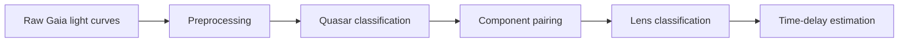

# TiLDe

**TiLDe** is a reproducible Python project for detecting quasar and
gravitational-lens candidates in Gaia light curves, then estimating
inter-component time delays.

The repository is organised for scientific handoff: research algorithms live
in importable `.py` modules, each module has a guided notebook, all time-delay
parameters are stored in named profiles, and the original research notebooks
remain available under `notebooks/legacy/`.

## Pipeline



| Stage | Python module | Guided notebook |
|---|---|---|
| Component grouping | `Utility/IdSep.py` | `notebooks/01_component_grouping.ipynb` |
| Cleaning and filtering | `Utility/Pretraitement.py` | `notebooks/02_preprocessing.ipynb` |
| Light-curve visualisation | `Utility/Plot.py` | `notebooks/03_visualisation.ipynb` |
| Quasar inference (RF + EDSM) | `Utility/Inference.py` | `notebooks/04_quasar_inference.ipynb` |
| Lens-pair random forest | `Utility/RF.py` | `notebooks/05_lens_random_forest.ipynb` |
| Lens-pair neural network | `Utility/LensNN.py` | `notebooks/06_lens_neural_network.ipynb` |
| Linear-interpolation delay | `Utility/time_delay_interpolation.py` | `notebooks/07_time_delay_interpolation.ipynb` |
| Adaptive P-spline delay | `Utility/time_delay_pspline.py` | `notebooks/08_time_delay_pspline.ipynb` |
| Package/import check | `Utility/__init__.py` | `notebooks/00_start_here.ipynb` |
| Synthetic smoke tests | `tests/smoke_test.py` | `notebooks/00_start_here.ipynb` |

## Start here

1. Follow [Windows and macOS installation](docs/INSTALLATION.md).
2. Read the [data contract](docs/DATA_FORMAT.md).
3. Open `notebooks/00_start_here.ipynb`.
4. Copy your CSV files into `data/` without changing the supplied model files.
5. Run the guided notebooks in numerical order.

The `data/` directory is intentionally empty because the research Gaia tables
are not redistributed in this archive. Each notebook checks its expected input
path before running and explains which file must be supplied.

## Time-delay command line

Classical interpolation:

```bash
python -m Utility.time_delay_interpolation data/cleaned_lightcurves.csv \
  --source-id 3361094865862486656 \
  --component-a 3361094865862486721 \
  --component-b 3361094865862486723 \
  --profile standard \
  --mc-samples 300
```

Adaptive P-spline:

```bash
python -m Utility.time_delay_pspline data/cleaned_lightcurves.csv \
  --source-id 5915407711751697280 \
  --components 5915407711751697345 5915407711751697347 \
  --names "A reference" B \
  --profile standard \
  --mc-samples 300
```

Batch P-spline run:

```bash
python -m Utility.time_delay_pspline data/cleaned_lightcurves.csv \
  --pairs configs/time_delay_system_pairs.csv \
  --profile legacy_notebook \
  --mc-samples 300 \
  --output-dir results/batch_time_delays
```

Run `python -m Utility.time_delay_interpolation --help` or
`python -m Utility.time_delay_pspline --help` for every option.

## Reproducibility

- `configs/time_delay_profiles.json` preserves quick, standard, original
  notebook and high-precision parameter adaptations.
- Gaia identifiers are loaded and exported as strings to prevent precision
  loss in spreadsheet software.
- Monte Carlo uncertainty draws use explicit random seeds.
- Batch results are checkpointed after every system.
- Existing trained models are kept in `models/`; their purpose and inputs are
  documented in `Models-Documentation/`.

## Documentation

- [Installation](docs/INSTALLATION.md)
- [Data format](docs/DATA_FORMAT.md)
- [Complete workflows](docs/WORKFLOWS.md)
- [Time-delay methodology](docs/TIME_DELAY_METHODS.md)
- [Supervisor handoff and troubleshooting](docs/SUPERVISOR_HANDOFF.md)
- [Change log](CHANGELOG.md)

## Scope

The preprocessing choices and trained models are adapted to Gaia epoch
photometry. Applying them to another survey requires validation, recalibration
and potentially retraining. Candidate probabilities and time delays are
scientific decision-support outputs, not automatic confirmations of a lens.
